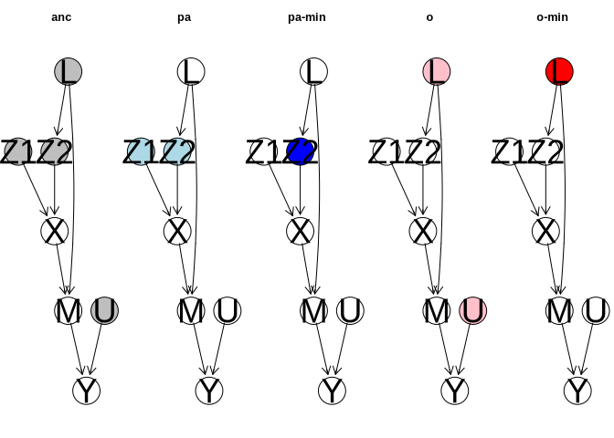

<!-- README.md is generated from README.Rmd. Please edit that file -->

# adjset

<!-- badges: start -->
<!-- badges: end -->

This package contains code for identifying valid adjustment sets in a
DAG, including the o-set, the minimal o-set and the minimal parent set.

## Installation

You can install the development version of adjset from
[GitHub](https://github.com/) with:

``` r
# install.packages("devtools")
devtools::install_github("verahk/adjset")
```

## Example

``` r
library(adjset)

# specify DAG row-wise:
dag <- rbind(Z1  = c(0, 0, 0, 1, 0, 0, 0),
             Z2  = c(0, 0, 0, 1, 0, 0, 0),
             L   = c(0, 1, 0, 0, 1, 0, 0),
             X   = c(0, 0, 0, 0, 1, 0, 0),
             M   = c(0, 0, 0, 0, 0, 1, 0),
             Y   = c(0, 0, 0, 0, 0, 0, 0),
             U   = c(0, 0, 0, 0, 0, 1, 0))
colnames(dag) <- rownames(dag)


# compute adjustment set w.r.t. X and Y
x <- 4
y <- 6
adjsets <- c("anc", "pa","pa_min", "o", "o_min")
for (a in adjsets)find_adjset(dag, x-1, y-1, a)+1
sets <- lapply(adjsets,
               function(a) find_adjset(dag, x-1, y-1, a)+1)
names(sets) <- adjsets
sets
#> $anc
#> [1] 1 2 3 7
#> 
#> $pa
#> [1] 1 2
#> 
#> $pa_min
#> [1] 2
#> 
#> $o
#> [1] 3 7
#> 
#> $o_min
#> [1] 3

# compare adjustment sets 
g <- graph::graphAM(dag, edgemode = "directed")

color <- c("grey", "lightblue",  "blue", "pink", "red")
names(color) <- adjsets
par(mfrow = c(1, 5),
    mar = c(5, 1, .1, .1))

for (a in names(sets)) {
  z <- sets[[a]]
  tmp <- rep(color[a], length(z))
  names(tmp) <- colnames(dag)[z]
  Rgraphviz::plot(g,
                  nodeAttrs = list(fillcolor = tmp),
                  main = a)
}
```



``` r


# compare runtimes with alternative routines
microbenchmark::microbenchmark(pcalg::optAdjSet(t(dag), x, y),
                               find_adjset(dag, x-1, y-1, "o")+1,
                               check = "equivalent")
#> Unit: microseconds
#>                                     expr      min       lq       mean    median
#>           pcalg::optAdjSet(t(dag), x, y) 2680.783 2733.999 2886.49998 2779.6960
#>  find_adjset(dag, x - 1, y - 1, "o") + 1   27.100   29.383   40.23919   38.4025
#>         uq      max neval cld
#>  2829.8270 5393.974   100   b
#>    46.3855   91.331   100  a

microbenchmark::microbenchmark(which(dag[, x] == 1),
                               find_adjset(dag, x-1, y-1, "pa")+1,
                               check = "equivalent")
#> Unit: microseconds
#>                                      expr   min     lq    mean median     uq
#>                      which(dag[, x] == 1) 1.740 1.7985 2.03706 2.0565 2.1475
#>  find_adjset(dag, x - 1, y - 1, "pa") + 1 5.408 5.5280 5.87847 5.6130 5.6960
#>     max neval cld
#>   7.195   100  a 
#>  28.176   100   b
```
